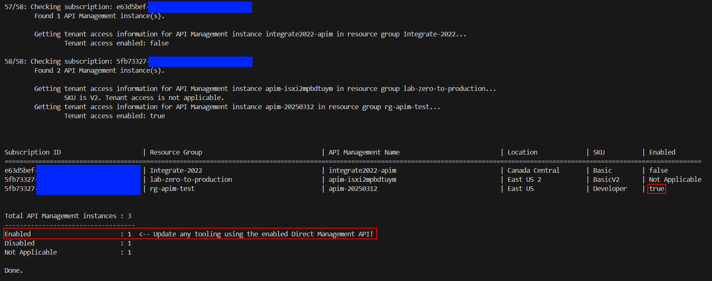

# Discover Direct Management API Use in API Management Instances

The Direct management API Management REST API is deprecated and will be [retired in March 2025](https://learn.microsoft.com/rest/api/apimanagement/apimanagementrest/api-management-rest).

This repo helps discover which API Management in your instances have this API enabled. The new V2 SKUs are not affected by this.

## Prerequisites

This script requires the [Azure CLI](https://docs.microsoft.com/cli/azure/install-azure-cli) to be installed prior to execution.

## Execution

Run the following script with your Azure tenant ID. Select any subscription if the login asks for one. The script will subsequently loop over all subscriptions in your tenant.

```sh
./apim-direct-management-api-statistics.sh <tenant-id>
```

You can also hard-code a test subscription at the top of the shell script to check a specific subscription. There's also a `SKIP_LOGIN` flag in the script that allows using the current tenant ID rather than repetitive logins.

## Results

The results will be displayed at the end of the run. You need to take action on any instance that has the API enabled as your tooling may soon no longer work.


